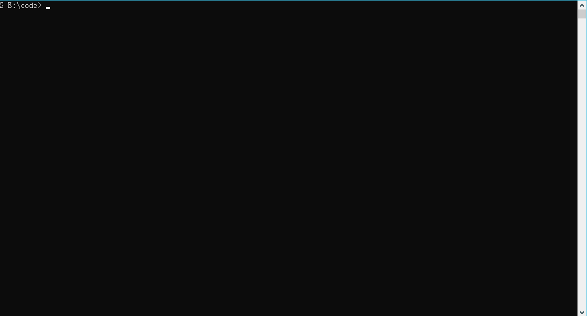

# Vite

> version：Vite2
>

## 一、Vite构建项目

1、利用Vite2构建vue项目

```powershell
npm init @vitejs/app #不带项目名（依次：项目命名>>选择框架>>选择script）
npm init @vitejs/app projectName #带项目名称（依次：选择框架>>选择script）
```
2、切换到项目目录

```shell
cd projectName
```

3、初始化项目

```shell
npm install
```

4、运行项目

```shell
npm run dev
```

5、打包项目



## 二、Vite配置

> [配置 Vite | Vite 官方中文文档 (vitejs.dev)](https://cn.vitejs.dev/config/#cachedir)

